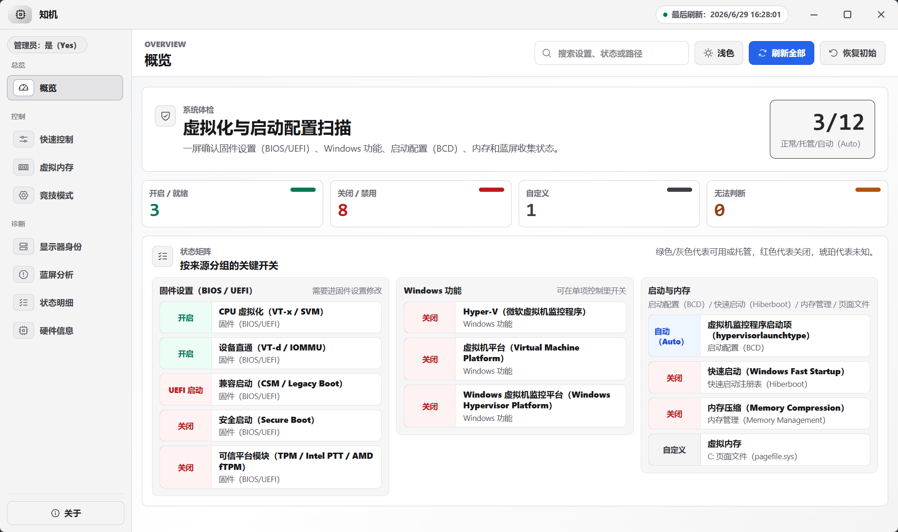

# 知机

[English](README.en.md)

知机是一个 Tauri + Rust 桌面工具，用于查看和调整 Windows 关键配置、虚拟内存、蓝屏收集、竞技模式优化和硬件信息。



## 功能

- 查看 CPU 虚拟化、Hyper-V、安全启动、TPM、BCD 等状态。
- 独立启用或关闭 Hyper-V、虚拟机平台、Windows 虚拟机监控程序平台。
- 调整 `hypervisorlaunchtype`、虚拟内存和小内存转储收集。
- 打开或导出 BlueScreenView 蓝屏分析结果。
- 在“竞技模式”中应用可还原的低风险 FPS 相关优化。
- 查看硬件信息和显示器身份，并提供显示器身份测试工具。

固件设置（例如 VT-x / SVM、安全启动、TPM）通常不能由 Windows 桌面程序直接修改。知机会提供状态提示和重启进入 BIOS/UEFI 的入口。

## 下载

普通用户建议直接下载 Release 中的安装包：

- GitHub Releases: https://github.com/LingCore/zhiji/releases

## 开发运行

需要先安装：

- Rust stable toolchain
- Node.js/npm
- Microsoft Edge WebView2 Runtime（Windows 10/11 通常已内置）

```powershell
npm install
npm run tauri dev
```

## 构建

```powershell
npm run tauri build
```

生成的安装包位于：

```text
src-tauri\target\release\bundle\nsis\
```

## 常见问题

### 任务栏图标看起来没有更新

Windows 可能会缓存旧的任务栏图标。更新安装包后，如果任务栏仍显示旧图标，可以先退出知机，取消固定任务栏图标，再重新打开并固定；必要时重启 Explorer 或重启 Windows。

知机的 `.ico` 已包含 Windows 任务栏常用尺寸，并把 `48x48` 图标放在首位，以减少系统缩放造成的模糊。

## 开源协议

项目源码使用 MIT License，详见 [LICENSE](LICENSE)。

随安装包打包的第三方工具见 [THIRD_PARTY_NOTICES.md](THIRD_PARTY_NOTICES.md)。
